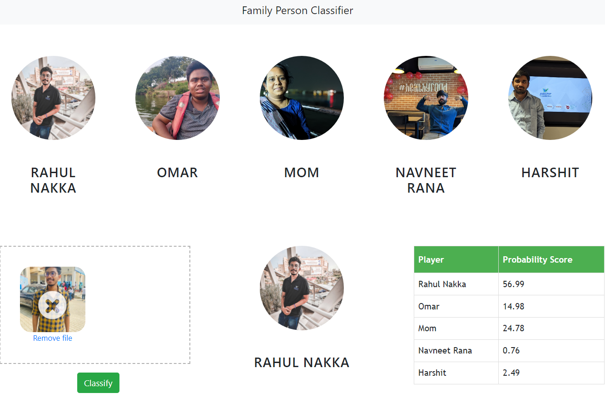

# Data Science and Machine Learning Project: Family Person Classification

## Introduction

In this data science and machine learning project, we aim to classify sports personalities. The scope of the classification is limited to the following 5 individuals:

- Myself
- My mom
- 3 Close Friends of mine

## Folder Structure

Here is how the project is organized:

- `UI/`: Contains the code for the UI website
- `server/`: Contains the Python Flask server code
- `model/`: Contains the Jupyter Notebook for model building
- `images_dataset/`: The dataset used for training our model. (I haven't uploaded it on Github for privacy concerns)

## Technologies Used

The following technologies were used in this project:

- **Programming Language**: Python
- **Data Cleaning**: Numpy and OpenCV
- **Data Visualization**: Matplotlib & Seaborn
- **Model Building**: Sklearn
- **IDE**: Jupyter Notebook, Visual Studio Code, and PyCharm
- **Server**: Python Flask for HTTP server
- **Front-End**: HTML/CSS/JavaScript

